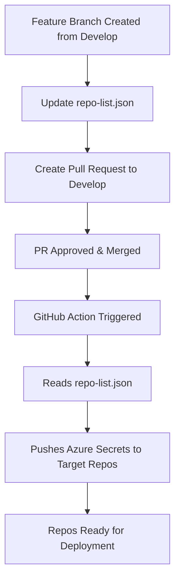

```markdown
# ⚙️ Pamten RecruitEdge — Azure Repo Access Automation

> **Automates Azure secret provisioning for all RecruitEdge GitHub repositories**  
> Whenever a repo is added to `repo-list.json`, the CI/CD pipeline updates its GitHub secrets with Azure credentials — enabling seamless deployments across environments.

---

## 🧭 Overview

This repository serves as a **central automation hub** that:
- Maintains a list of RecruitEdge repositories in a single JSON file.
- Automatically provisions Azure secrets (`Client ID`, `Tenant ID`, `Subscription ID`) to each listed repo.
- Supports **Dev** and **Prod** environments based on the branch (`develop` or `master`).
```
---

## 🔁 Flow Diagram



---

## 📦 Repository Structure

```
pamten-re-azure-repo-access/
│
├── repo-list.json          # List of all RecruitEdge repos needing Azure secrets
├── .github/
│   └── workflows/
│       └── sync-repo-secrets.yml  # CI/CD workflow that pushes Azure secrets
└── README.md
```

---

## 🧩 Developer Flow

### 1️⃣ Create a Feature Branch

Start from the `develop` branch:

```bash
git checkout develop
git pull origin develop
git checkout -b feature/<your-branch-name>
```

### 2️⃣ Update the Repo List

Edit the file `repo-list.json` and add your repo name:

```json
{
  "repos": [
    "pamten-re-frontend-react",
    "pamten-re-backend-python",
    "pamten-re-backend-java",
    "pamten-re-common-libs",
    "pamten-re-newrepo"
  ]
}
```

> ⚠️ **Important:**
>
> * Avoid trailing commas at the end of the list.
> * Ensure valid JSON formatting.

### 3️⃣ Commit and Push

```bash
git add repo-list.json
git commit -m "Add pamten-re-newrepo to repo list"
git push origin feature/add-newrepo
```

### 4️⃣ Create a Pull Request

* Create a PR from your feature branch → **develop**
* Once approved and merged:

  * The CI/CD workflow triggers automatically.
  * Azure secrets get pushed into your repo’s environment.

---

## 🌍 Environment Mapping

| Branch    | Environment | Purpose                              |
| --------- | ----------- | ------------------------------------ |
| `develop` | `dev`       | Internal testing and dev deployments |
| `master`  | `prod`      | Production-ready deployments         |

---

## 🧰 Secrets Managed

Each repo receives these secrets automatically:

| Secret Name             | Description                      |
| ----------------------- | -------------------------------- |
| `AZURE_CLIENT_ID`       | Azure App Registration Client ID |
| `AZURE_TENANT_ID`       | Azure Directory (Tenant) ID      |
| `AZURE_SUBSCRIPTION_ID` | Azure Subscription ID            |

These secrets are used by the repo’s GitHub Actions to authenticate and deploy to Azure.

---

## 🔐 Secrets in This Repo

| Secret                  | Purpose                                                                      |
| ----------------------- | ---------------------------------------------------------------------------- |
| `AZURE_CLIENT_ID`       | Client ID for Azure Dev/Prod environments                                    |
| `AZURE_TENANT_ID`       | Tenant ID for Azure account                                                  |
| `AZURE_SUBSCRIPTION_ID` | Subscription ID for Azure resource group                                     |
| `REPO_ADMIN_TOKEN`      | Personal Access Token (PAT) with permission to update secrets in other repos |

> 🧠 The PAT must have scopes:
> `repo`, `workflow`, `admin:repo_hook`, and `read:org`.

---

## 🚀 Workflow Trigger

| Trigger Type        | Description                        |
| ------------------- | ---------------------------------- |
| `PR` to `develop` | Syncs **Dev** environment secrets  |
| `PR` to `master`  | Syncs **Prod** environment secrets |
| `workflow_dispatch` | Allows manual sync via Actions tab |

---

## 🛡️ Security and Access Rules

* Only **approved PRs** merged into `develop` or `master` can trigger secret updates.
* Azure credentials are stored securely as **GitHub Environment Secrets**.
* `REPO_ADMIN_TOKEN` is a bot-managed token with scoped permissions to only the RecruitEdge repos.

---

## 🧠 Troubleshooting Guide

| Issue                                                      | Possible Cause                            | Fix                                                                       |
| ---------------------------------------------------------- | ----------------------------------------- | ------------------------------------------------------------------------- |
| Workflow not triggering                                    | Wrong branch or file not in `paths:` list | Merge to `develop`/`master` from feature - modify `repo-list.json`        |
| `jq: parse error`                                          | Invalid JSON (e.g., trailing commas)      | Validate JSON at [jsonlint.com](https://jsonlint.com)                     |
| `ValueError: The public key must be exactly 32 bytes long` | Repo environment (dev/prod) not created   | Go to **Settings → Environments** → create `dev` and `prod`               |

---

## 🧾 Example: Adding a New Repo

```bash
# Step 1: Create branch from develop
git checkout -b feature/add-pamten-re-azure-infra

# Step 2: Add new repo to JSON
vim repo-list.json

# Step 3: Commit & push
git commit -am "Add pamten-re-azure-infra to repo list"
git push origin feature/add-pamten-re-azure-infra

# Step 4: Create PR → develop → merge
# The CI/CD workflow will run automatically and sync Azure secrets
```

---

## 👥 Maintainers

| Name                           | Role                        |
| ------------------------------ | --------------------------- |
| **Vinay Kiran Reddy Bhavanam** | Infra Owner / Data Engineer |
